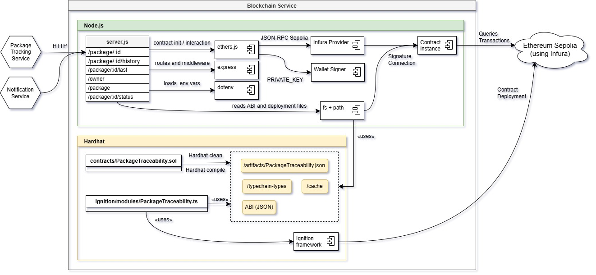

# Blockchain service

[](https://github.com/amollrod/blockchain-service/actions/workflows/pipeline.yml)
[](https://www.gnu.org/licenses/gpl-3.0.html)
[](https://creativecommons.org/licenses/by-nc/3.0/es/)

El microservicio blockchain-service es el componente encargado de asegurar la inmutabilidad del historial de envíos mediante el uso de smart contracts desplegados en la red Ethereum Sepolia. Permite registrar y consultar eventos logísticos en la blockchain a través de una API REST construida con Node.js y Ethers.js, ofreciendo garantías criptográficas sobre el estado de cada paquete. Su despliegue y mantenimiento se gestiona mediante Hardhat, y su integración se realiza de forma transparente con el resto del sistema distribuido.



## 1- Generación, compilado y despliegue del contrato

Esta sección documenta el uso de hardhat para poder generar y acabar desplegando un smart contract en la `Sepolia testnet`.

### 1.1- Creación del contrato

Lo primero que se necesita es crear el contrato. Para ello lo definiremos dentro del directorio `/contracts` del proyecto. Mostremos un ejemplo:

```solidity
// SPDX-License-Identifier: MIT
pragma solidity ^0.8.28;

contract PackageTraceability {
    // implementación del contrato aquí
}
```

### 1.2- Compilación del contrato

Para poder compilar los contratos dentro del directorio `/contracts` del proyecto, se usan los comandos siguientes:

```shell
npx hardhat clean 
npx hardhat compile
```
Ejemplo de respuesta:
```
Compiling...
Compiled 1 contract successfully
```

Esto debería de generar los directorios `/typechain-types`, `/artifacts` y `/cache`

### 1.3- Testear el contrato

Si queremos probar el contrato, podemos hacerlo mediante el comando de prueba de hardhat. Para ello previamente necesitamos haber creado un fichero de test dentro del directorio `/test`  

```shell
npx hardhat test
```
Ejemplo de respuesta:
```
npx hardhat test

  PackageTraceability
    Deployment
      √ Should deploy successfully (308ms)
    Access control
      √ Should allow only backend to create packages
      √ Should allow only backend to update package status
    Create package
      √ Should create a package successfully
      √ Should have one history event immediately after creation
      √ Should fail to create a duplicate package
      √ Should fail to create if origin is empty
      √ Should fail to create if destination is empty
    Update package
      √ Should update package status successfully
      √ Should fail to update a non-existent package
      √ Should fail to update status if status is empty
      √ Should fail to update status if location is empty
    Get package details
      √ Should retrieve package details
      √ Should fail to retrieve a non-existent package
    Get history
      √ Should retrieve the full package history
      √ Should fail retrieving history of non-existent package
    Get last status
      √ Should retrieve the last status of a package
      √ Should fail retrieving the last status of non-existent package
      √ Should isolate history and details between different packages

  19 passing (387ms)
```

### 1.4- Desplegar el contrato

Para desplegar el contrato en la `Sepolia testnet`, usaremos el comando:

```shell
npx hardhat ignition deploy ./ignition/modules/PackageTraceability.ts --network sepolia
```
Ejemplo de respuesta:
```
√ Confirm deploy to network sepolia (11155111)? ... yes
Hardhat Ignition 🚀

Deploying [ PackageTraceabilityModule ]

Batch #1
  Executed PackageTraceabilityModule#PackageTraceability

[ PackageTraceabilityModule ] successfully deployed 🚀

Deployed Addresses

PackageTraceabilityModule#PackageTraceability - 0x8bE1fCdee10d9b0931eF41060Db7c3e8b2061032
```

## 2- Interacción con el smart contract

Esta sección establece lo necesario para poder interactuar con el smart contract desplegado en la `Sepolia testnet`. Para poder hacerlo, se ha preparado un servicio en Node que interactúa mediante `ethers.js`. El primer paso será levantar el servicor mediante:

```shell
node server.js
```
Ejemplo de respuesta:
```
# API running on http://localhost:3000
```

Se han expuesto mediante una API REST los distintos métodos del contrato. Los documentamos a continuación.

### Consultar un paquete por ID

Petición:
```shell
curl -X GET http://localhost:3000/package/1
```

Respuesta:
```json
{
  "id": "1",
  "origin": "Madrid",
  "destination": "Barcelona"
}
```

### Consultar historial de un paquete

Petición:
```shell
curl -X GET http://localhost:3000/package/1/history
```

Respuesta:
```json
{
  "id": "1",
  "history": [
    {
      "status": "CREATED",
      "location": "Madrid",
      "timestamp": "1740694668"
    },
    {
      "status": "IN_TRANSIT",
      "location": "Zaragoza",
      "timestamp": "1740701000"
    },
    {
      "status": "DELIVERED",
      "location": "Barcelona",
      "timestamp": "1740710000"
    }
  ]
}
```

### Crear un paquete

Petición:
```shell
curl -X POST http://localhost:3000/package \
     -H "Content-Type: application/json" \
     -d '{"id": "1", "origin": "Madrid", "destination": "Barcelona"}'
```
Respuesta:
```json
{
  "message": "Package created successfully",
  "txHash": "0xd23707d91f8cf724fc19e94b3b07d3b31b2c8e801bad6bcd45d290de7d5dc8f6"
}
```

### Actualizar estado y ubicación de un paquete

Petición:
```shell
curl -X PUT http://localhost:3000/package/1/status \
     -H "Content-Type: application/json" \
     -d '{"status": "IN_TRANSIT", "location": "Zaragoza"}'
```

Respuesta:
```json
{
  "message": "Package status updated",
  "txHash": "0xae108fdcb5a3eae259a5b134f019b22695aa1e5faa8515d3f76eefea36061dc1"
}
```

## 3- Ejecutar con Docker localmente

> [!WARNING]  
> Esto solo se puede realizar si ya se cuenta con el fichero .env; en caso contrario, revisar el apartado 4.

Si deseas usar Docker Compose, puedes construir y correr el contenedor con:

```shell
docker compose up --build
```

En caso de querer usar el Dockerfile:

```shell
docker build -t blockchain-api .
docker run -p 3000:3000 --env-file .env blockchain-api
```

## 4- Ejecutar con Docker usando GHCR

Este proyecto incluye una imagen Docker precompilada y publicada en el [GitHub Container Registry](https://ghcr.io/). Dicha imagen contiene todo lo necesario para ejecutar el servicio sin configuración adicional. Está marcada como privada por motivos de seguridad, por lo que es necesario autenticarse para acceder.

### 4.1 solicitar el token de acceso

El propietario del repositorio ha generado un token de acceso para poder hacer un `read:packages`. Esto permitirá poder obtener acceso a la imagen privada del GitHub Container Registry. Póngase en contacto con el propietario, [amollrod@uoc.edu](mailto:amollrod@uoc.edu?subject=[GitHub]%20ACCESS%20TOKEN).

### 4.2 - Iniciar sesión en ghcr.io

Una vez tenemos el token de acceso, ejecuta el siguiente comando en la terminal (reemplaza YOUR_TOKEN por el real):

```shell
echo YOUR_TOKEN | docker login ghcr.io -u amollrod --password-stdin
```

Si la autenticación es correcta, verás un mensaje como:

```
Login Succeeded
```

### 4.3 - Descargar la imagen

Con el login exitoso, ya podemos hacer pull de la imagen autocontenida:

```shell
docker pull ghcr.io/amollrod/blockchain-api:latest
```

Verás un mensaje como:

```
latest: Pulling from amollrod/blockchain-api
Digest: sha256:9679b6a214b2cf330c0abf7d3e0d2ba40a69556d80f9ed061f53b45c02050591
Status: Downloaded newer image for ghcr.io/amollrod/blockchain-api:latest
ghcr.io/amollrod/blockchain-api:latest
```

### 4.4 - Ejecutar el contenedor

Una vez descargada, puedes ejecutarla con:

```shell
docker run -p 3000:3000 ghcr.io/amollrod/blockchain-api:latest
```

Con todo ya levantado, podemos hacer las operaciones del apartado 2.

---

## Licencias

- Este repositorio está licenciado bajo los términos de la [GNU General Public License v3.0](./LICENSE)
- La memoria del TFG está protegida bajo: [CC BY-NC 3.0 España](https://creativecommons.org/licenses/by-nc/3.0/es/) y [GNU Free Documentation License 1.3](https://www.gnu.org/licenses/fdl-1.3.html)

Proyecto desarrollado como parte del TFG de **Alex Moll Rodríguez** para la **UOC** en 2025.